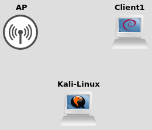

# What is this ?

Simulate Wi-Fi (802.11) between Linux Virtual Machines on Qemu/VirtualBox/...

* It can be used in Hypervisors (GNS3, QEmu, Virtualbox, VMware, Hyper-V, ...)
* The Wireless emulator uses the `mac80211_hwsim` linux driver
* Implements the packet loss simulation based on distance
* Emulates the node mobility in GNS3

* Tested:
    * with `hostapd` and `wpa_supplicant` with these configurations:
       * Open
       * WEP
       * WPA2
       * WPA-EAP
    * in the context of WPA2 attack with `Aircrack-NG` (Kali / Parrot-OS)
    * with OpenWRT

* Remaining features to be implemented:

    * Integrate to other OS (Windows...)
    * Add obstacle models
    * Etc.



# Explanations

* With the parameter "-h" (or "--help"), all programs display help and their parameters

* ***vwifi-client*** should be started on the VMs, and ***vwifi-server*** on the Host.
* ***vwifi-client*** and ***vwifi-server*** can communicate either with the VHOST protocol (by default), or with the TCP protocol.
* With the option "-s" (or "--spy"), ***vwifi-client*** :
    * receives always all communications, even if the loss of packets is enable ;
    * works only with TCP ;
    * connects to 127.0.0.1, by default ;
* ***vwifi-client*** uses the `mac80211_hwsim` kernel module to have the wifi interfaces.
* To use TCP protocol, ***vwifi-server*** and ***vwifi-client*** must be connected to a different IP network than that of the wifi.
* ***vwifi-add-interfaces*** is used to create the wlan interfaces to the module `mac80211_hwsim`. ***vwifi-client*** controls only these interfaces. ***vwifi-add-interfaces*** can be run several times.
* ***vwifi-ctrl*** is used to interact with ***vwifi-server***.
* ***vwifi-server*** can directly enable packet loss with the parameter "-l" (or "--lost-packets")
* If ***vwifi-server*** detects the same IP for several ***vwifi-client*** (due to PAT/NPAT/...), use the option "-u" ("-- use-port-in-hash") on ***vwifi-server*** to add the network port to create the ID for each client, instead of just using the IP. Attention, the display of ID by ***vwifi-server*** and ***vwifi-client*** will no longer be the same.

* You can change the defaults IP and ports with parameters (see the parameter "-h" to help)

# Install

## On Debian-based Linux distributions

### Dependencies

```bash
sudo apt-get update
sudo apt-get install cmake make g++ pkg-config
sudo apt-get install libnl-3-dev libnl-genl-3-dev
```

### Building

* Optional: To download and update the file `mac80211_hwsim.h` (if needed, requires wget) :

```bash
wget -q -N https://raw.githubusercontent.com/torvalds/linux/master/drivers/net/wireless/virtual/mac80211_hwsim.h -P src
```
* To change the default ports and IP, edit: `src/config.h`

* To configure :

```bash
mkdir build
cd build
cmake ..
```
* To Customize the build :
    * For a debug build : Add `-DCMAKE_BUILD_TYPE=Debug`
    * To disable VHOST protocol : Add `-DENABLE_VHOST=OFF`

* To build : `make`

* To install : `sudo make install`

## On OpenWRT

* See the wiki : [Install-vwifi-on-OpenWRT-X86_64](https://github.com/Raizo62/vwifi/wiki/Install-on-OpenWRT-X86_64)

# Configuration

## Method 1 : With VHOST

### Host

* Shell :
    * Load the module VHOST :
   ```bash
   # sudo modprobe -r vhost_vsock vmw_vsock_virtio_transport_common vsock # if necessary

   sudo modprobe vhost_vsock
   sudo chmod a+rw /dev/vhost-vsock
   ```
    * Start the ***vwifi-server*** :
   ```bash
   vwifi-server
   ```

* Hypervisor
  * QEmu : add the option : `-device vhost-vsock-pci,id=vwifi0,guest-cid=NUM` with NUM an identifier greater than  2
  * GNS3 (>= 2.2) : QEmu : add the option : `-device vhost-vsock-pci,id=vwifi0,guest-cid=%guest-cid%`

### Each Guest

* Load the necessary module mac80211_hwsim with 0 radios :
```bash
sudo modprobe mac80211_hwsim radios=0
```

* Create the wlan interfaces (on this example, 2 interfaces) :
    * Without parameters, the MAC address is preset with the default value "74:F8:F6", and the 4th byte is randomized
    * ***vwifi-client*** can do the same with the parameters "--number" and "--mac"
```bash
sudo vwifi-add-interfaces 2 0a:0b:0c:03:02
```

* Connect all these wlan interfaces to the ***vwifi-server*** :
```bash
sudo vwifi-client
```

* ***vwifi-client*** displays the CID of the VM in the Hypervisor. It is used by ***vwifi-server*** to identify this guest.

## Method 2 : With TCP

* ***vwifi-server*** and ***vwifi-client*** must be connected to a different IP network than that of the wifi (for example : 172.16.0.0/16)

### Host

* Start the ***vwifi-server*** :

```bash
vwifi-server
```

* We will suppose that the Host have the IP address : 172.16.0.1

### Each Guest

* Load the necessary module mac80211_hwsim with 0 radios :
```bash
sudo modprobe mac80211_hwsim radios=0
```

* Create the wlan interfaces (on this example, 2 interfaces) :
    * Without parameters, the MAC address is preset with the default value "74:F8:F6", and the 4th byte is randomized
    * ***vwifi-client*** can do the same with the parameters "--number" and "--mac"
```bash
sudo vwifi-add-interfaces 2 0a:0b:0c:03:02
```

* Connect all these wlan interfaces to the ***vwifi-server*** :
```bash
sudo vwifi-client 172.16.0.1
```

* ***vwifi-client*** displays an ID which is an hashsum of the IP. It is used by ***vwifi-server*** to identify this guest.

# Capture packets from Host

## Configure the Spy

```bash
sudo modprobe mac80211_hwsim radios=0
sudo vwifi-client -s -n 1
```

## Capture

* Configure wlan0 to monitor mode :
```bash
sudo ip link set wlan0 down
sudo iw wlan0 set monitor control
sudo ip link set wlan0 up
```

### With tcpdump

* Capture from wlan0 :
```bash
sudo tcpdump -n -i wlan0
```

### With wireshark

* Start Wireshark and capture from wlan0 :
```bash
sudo wireshark
```

# Control

## Host

* Show the list of connected guest (display : cid and coordinate x, y z) :
```bash
vwifi-ctrl ls
```

* Set the new coordinate (11, 12, 13) of the guest with the cid 10 :
```bash
vwifi-ctrl set 10 11 12 13
```

* Set the name "AP" of the guest with the cid 10 :
```bash
vwifi-ctrl setname 10 AP
```

* Enable the lost of packets :
```bash
vwifi-ctrl loss yes
```

* Disable the lost of packets :
```bash
vwifi-ctrl loss no
```

* Display the config of ***vwifi-server*** :
```bash
vwifi-ctrl status
```

* Display the distance in meters between the guest with the cid 10 and the guest with the cid 20 :
```bash
vwifi-ctrl distance 10 20
```

* Set the scale of the distances between the clients to 0.005
```bash
vwifi-ctrl scale 0.005
```

# Examples of commands to test Wifi

## Test 1 : WPA

### Packages needed on the guests for this test

```bash
sudo apt install hostapd wpasupplicant
```

### Guests

* Guest Wifi 1 :

```bash
sudo ip a a 10.0.0.1/8 dev wlan0

sudo hostapd tests/hostapd_wpa.conf
```

* Guest Wifi 2 :
```bash
sudo wpa_supplicant -Dnl80211 -iwlan0 -c tests/wpa_supplicant.conf

sudo ip a a 10.0.0.2/8 dev wlan0
ping 10.0.0.1
```

* Guest Wifi 3 :
```bash
sudo wpa_supplicant -Dnl80211 -iwlan0 -c tests/wpa_supplicant.conf

sudo ip a a 10.0.0.3/8 dev wlan0
ping 10.0.0.2
```

## Test 2 : Open

### Packages needed on the guests for this test

```bash
sudo apt install hostapd iw tcpdump
```

### Guests

* Guest Wifi 1 :

```bash
sudo ip a a 10.0.0.1/8 dev wlan0

sudo hostapd tests/hostapd_open.conf
```

* Guest Wifi 2 :
```bash
sudo ip link set up wlan0
sudo iw dev wlan0 connect mac80211_open

sudo ip a a 10.0.0.2/8 dev wlan0
ping 10.0.0.1
```

* Guest Wifi 3 :
```bash
sudo ip link set up wlan0
sudo tcpdump -n -e -I -i wlan0 -w /hosthome/projects/vwifi_capture_wlan0.pcap
```

### Host

```bash
tail -f -c +0b /home/user/projects/vwifi_capture_wlan0.pcap | wireshark -k -i -
```

## Test 3 : Ad-Hoc

### Packages needed on the guests for this test

```bash
sudo apt install iw
```

### Guests

* Guest Wifi 1 :
```bash
sudo ip link set up wlan0
sudo iw wlan0 set type ibss
sudo iw wlan0 ibss join MYNETWORK 2412 # frequency 2412 is channel 1

sudo ip a a 10.0.0.1/8 dev wlan0
```

* Guest Wifi 2 :
```bash
sudo ip link set up wlan0
sudo iw wlan0 set type ibss
sudo iw wlan0 ibss join MYNETWORK 2412 # frequency 2412 is channel 1

sudo ip a a 10.0.0.2/8 dev wlan0
ping 10.0.0.1
```

## Test 4 : WEP

### Packages needed on the guests for this test

```bash
sudo apt install hostapd
```

### Guests

* Guest Wifi 1 :

```bash
sudo ip a a 10.0.0.1/8 dev wlan0

sudo hostapd tests/hostapd_wep.conf
```

* Guest Wifi 2 :
```bash
cat << EOF | sudo tee -a /etc/network/interfaces > /dev/null

iface wlan0 inet static
    wireless-essid AP_WEP
    wireless-key s:12345
    address 10.0.0.2
    netmask 255.255.255.0

EOF
sudo ifup wlan0

ping 10.0.0.1
```

# Others Tools

* start-vwifi-client.sh : do all the commands necessary to start ***vwifi-client*** on a Guest
* fast-vwifi-update.sh : set with ***vwifi-ctrl*** the coordinates of each VMs which has the option `guest-cid=`, found in the open project of GNS3
* client.sh : configure the client wifi with Open or WPA
* Makefile.dependency.sh : generate automatically the file "Makefile.in", include in "Makefile", which contains dependencies for "make"
